# Kalman Filter ASIC

A 2-state, 16-bit fixed-point Kalman Filter ASIC implementation in TSMC 65nm technology, based on the architecture proposed in:

> R. Chávez-Bracamontes, M.A. Gurrola-Navarro, H.J. Jiménez-Flores, and M. Bandala-Sánchez, "VLSI architecture of a Kalman filter optimized for real-time applications," *IEICE Electronics Express*, Vol.13, No.6, pp.1-11, 2016. [DOI: 10.1587/elex.13.20160043](https://doi.org/10.1587/elex.13.20160043)

## Project Overview

The Kalman Filter is a recursive algorithm that estimates the state of a linear dynamic system from noisy measurements. This ASIC implementation targets real-time applications such as inertial navigation systems, where low power consumption and deterministic latency are critical.

### Kalman Filter Algorithm

The implementation follows the conventional discrete-time Kalman Filter formulation:

**Time Update (Predict)**
```
x̂⁻ₖ = Φₖ₋₁ x̂⁺ₖ₋₁ + Gₖ₋₁ uₖ₋₁        (State prediction)
P⁻ₖ = Φₖ₋₁ P⁺ₖ₋₁ Φᵀₖ₋₁ + Qₖ₋₁        (Covariance prediction)
```

**Measurement Update (Correct)**
```
Kₖ = P⁻ₖ Hᵀₖ (Hₖ P⁻ₖ Hᵀₖ + Rₖ)⁻¹     (Kalman gain)
x̂⁺ₖ = x̂⁻ₖ + Kₖ (yₖ - Hₖ x̂⁻ₖ)        (State update)
P⁺ₖ = (I - Kₖ Hₖ) P⁻ₖ               (Covariance update)
```

Where:
- **x**: State vector (position, velocity)
- **P**: Error covariance matrix
- **Φ**: State transition matrix
- **Q**: Process noise covariance
- **H**: Measurement matrix
- **R**: Measurement noise covariance
- **K**: Kalman gain
- **y**: Measurement

## Architecture

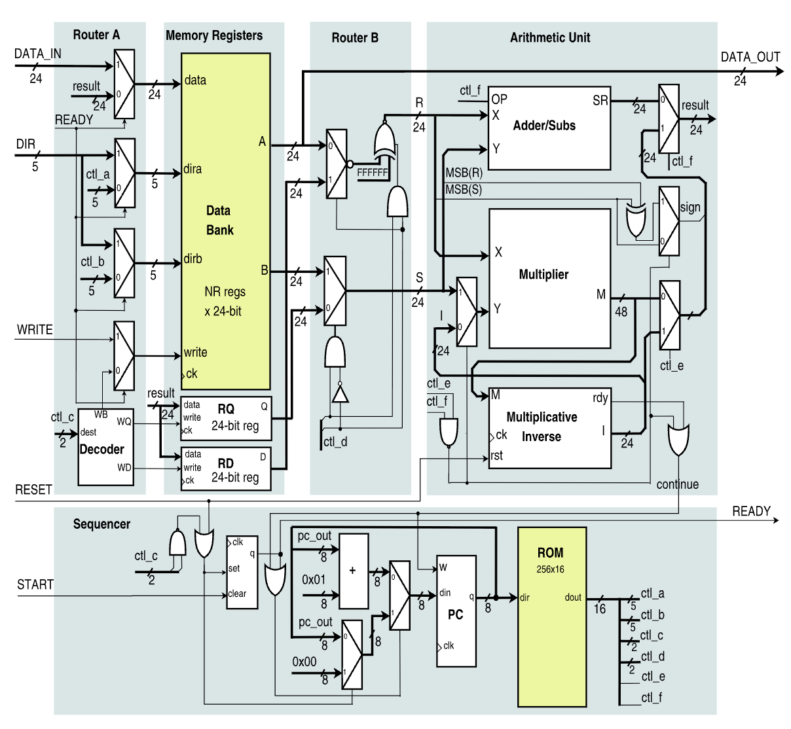

### Key Features

- **2-state, 1-measurement Kalman Filter** (expandable architecture)
- **24-bit fixed-point arithmetic** (Q9.14: 1 sign + 9 integer + 14 fractional bits)
- **Single-cycle operations** for ADD, SUB, MUL
- **24-cycle multiplicative inverse** using successive approximation
- **~196 clock cycles per KF iteration** (2-state configuration)
- **TSMC 65nm** standard cell implementation

### Instruction Set

## RTL Simulation

The ASIC design was validated against a Python reference implementation over 500 iterations. The plot below shows the Kalman Filter tracking a noisy position signal:

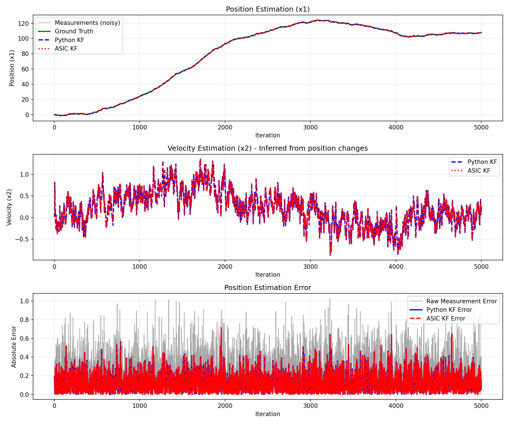

The ASIC output closely matches the Python reference, demonstrating correct fixed-point implementation of the Kalman Filter algorithm.

## Synthesis

- **Top**

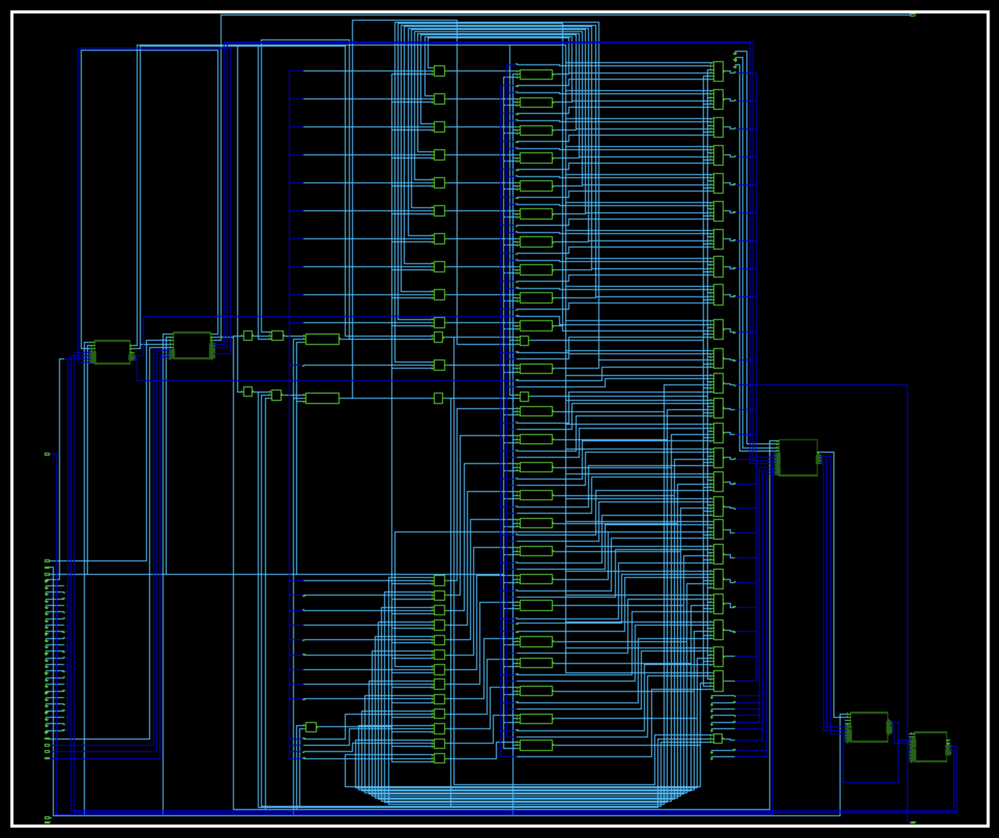

- **Submodules**

|  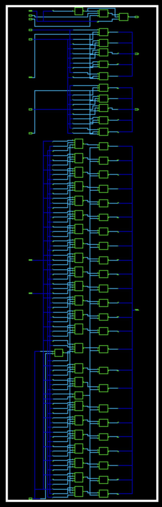  |  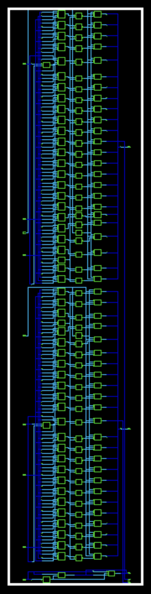  |  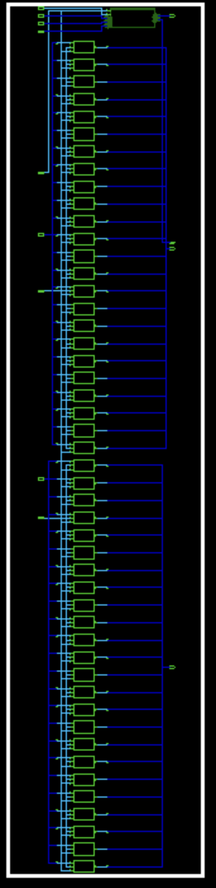  |  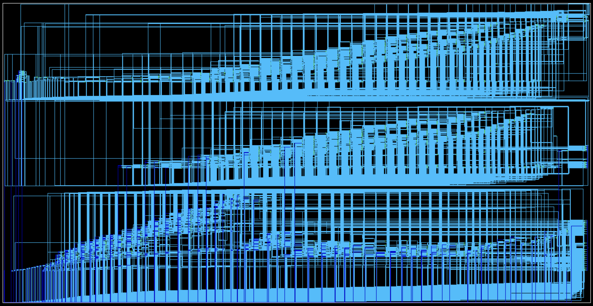  |  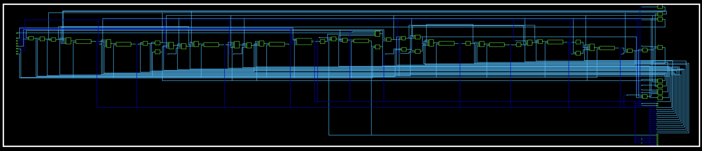  | 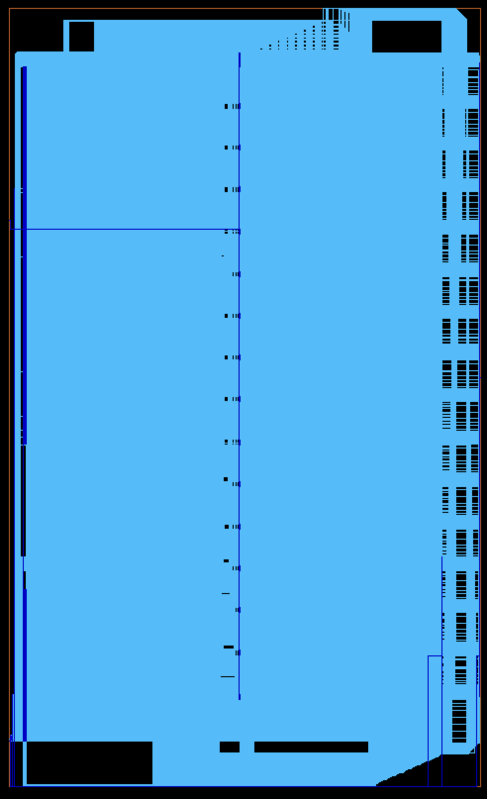 |
| :-----------------------------: | :-----------------------------: | :---------------------------: | :-----------------: | :-------------------------------: | :-----------------: |
| [Router A](/syn/router_a_syn.v) | [Router B](/syn/router_b_syn.v) | [Mem Reg](/syn/mem_reg_syn.v) | [AU](/syn/au_syn.v) | [Sequencer](/syn/sequencer_syn.v) |         ROM         |

### Summary

| Module     |  Cells | Comb. Area (µm²) | Seq. Area (µm²) |                               Total Area (µm²) |                           Critical Path (ns) |
| ---------- | -----: | ---------------: | --------------: | ---------------------------------------------: | -------------------------------------------: |
| **kf_top** | 18,770 |         37,458.7 |        34,480.4 |   [71,939.2](/syn_top/syn_report_area_top.txt) |   [6.90](/syn_top/syn_report_timing_top.txt) |
| Router A   |     63 |            136.4 |             0.0 |     [136.4](/syn/syn_report_area_router_a.txt) |  [0.48](/syn/syn_report_timing_router_a.txt) |
| Router B   |    153 |            341.3 |             0.0 |     [341.3](/syn/syn_report_area_router_b.txt) |  [0.58](/syn/syn_report_timing_router_b.txt) |
| Mem Reg    |  2,804 |          5,084.6 |         5,702.4 |   [10,787.0](/syn/syn_report_area_mem_reg.txt) |   [1.15](/syn/syn_report_timing_mem_reg.txt) |
| AU         |  3,897 |         12,093.8 |           943.2 |        [13,037.0](/syn/syn_report_area_au.txt) |        [6.43](/syn/syn_report_timing_au.txt) |
| Sequencer  | 11,742 |         19,804.3 |        28,078.2 | [47,882.5](/syn/syn_report_area_sequencer.txt) | [1.53](/syn/syn_report_timing_sequencer.txt) |

## Post-Synthesis Simulation

## Layout

### Core Layout
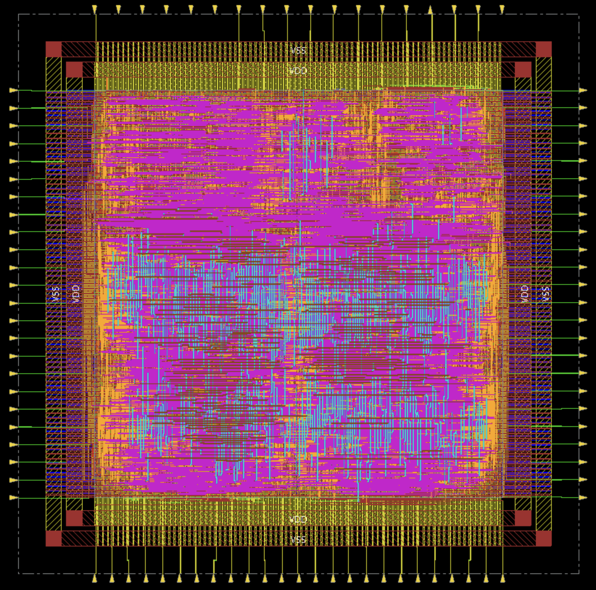

### Full Chip with Padframe
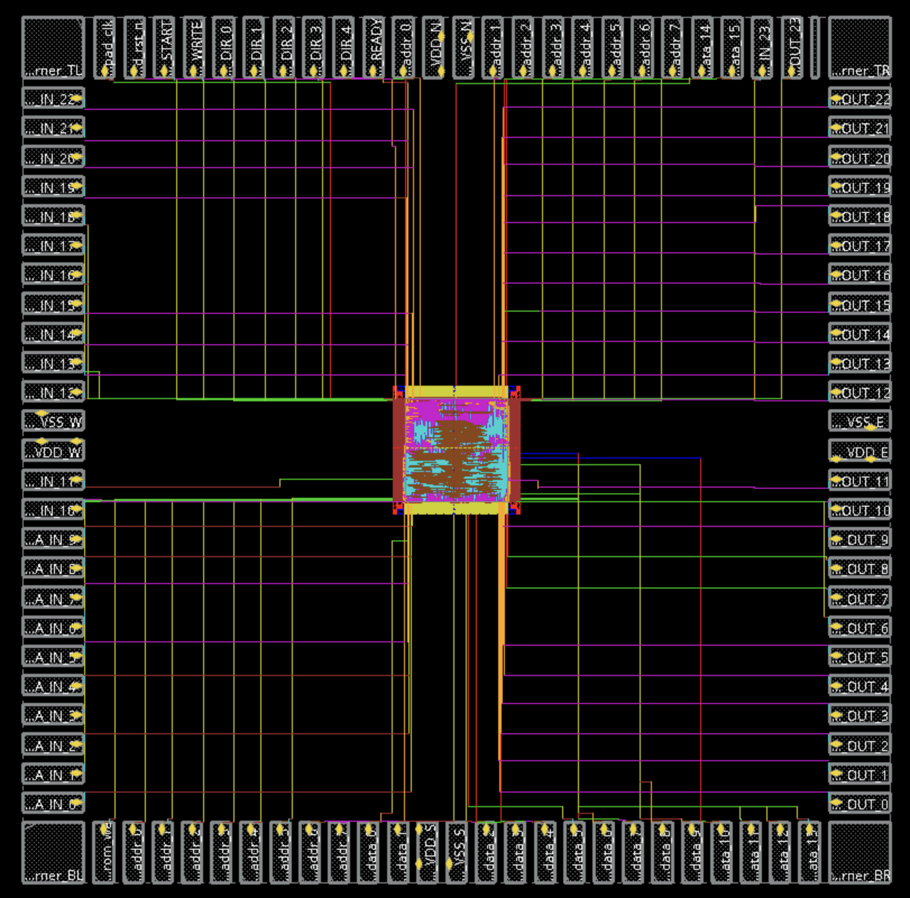
